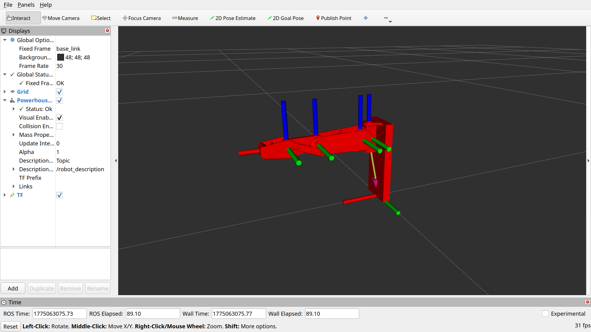
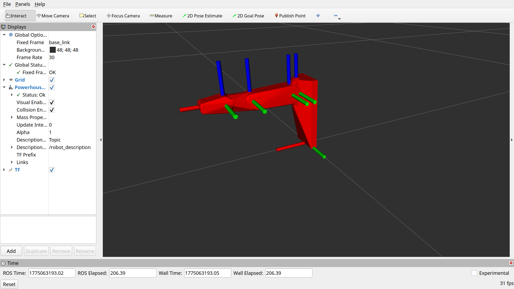

# Onshape URDF Export with Blender
#### Authors: Cole Abbott, Heinrich Asbury, Jared Berry, Evan Bulatek, and Benji Sobeloff-Gittes

This is a method that uses Blender to export a robot assembly from onshape.

#### Instructions
1. Export full assembly from onshape as STL file
2. Import as STL to blender
3. Click on full STL -> `Edit mode -> A -> P -> Separate by loose parts`
4. Use wireframe and join meshes `(Ctrl + J)` to chunk mesh into 5 links
    * Name them: `base_link, mcp_link, proximal_phalanx, middle_phalanx, distal_phalanx`
    * Put these into a collection titled `visual`
5. Ensure `base_link` is at (0,0,0)
6. Select each mesh, look at incoming joint axis.
    * Go to edit mode
    * Select opposite faces on shaft
    * `Shift + S -> 3D Cursor to selected`
    * Back to object mode -> `Object -> Origin to 3D Cursor`
    * `Shift + A -> Empty -> Arrow`
    * Align arrow with axis of rotation (do not translate, only rotate!)
    * NOTE: For middle_phalanx, look at outgoing joint axis of proximal_phalanx
7. Add the Empty objects to a collection named `joint_axes`
    * Name them: `mcp_splay, mcp_flex, pip_flex, dip_flex`
8. Duplicate visual meshes and move duplicates to `collision` collection
    * Change names to `col_<visual_mesh_name>`
9. For each visual mesh:
    * `Edit mode -> A -> X -> Limited dissolve`
10. For each collision mesh:
    * `Edit mode -> A -> Mesh -> Convex Hull -> X -> Limited dissolve`
11. Run script from scripting tab in blender
    * Make sure to set up paths and robot geometry in script

The visual geometry in rviz

The collision geometry in rviz
